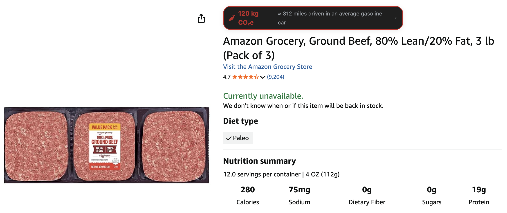
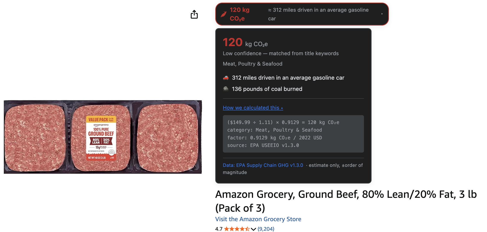
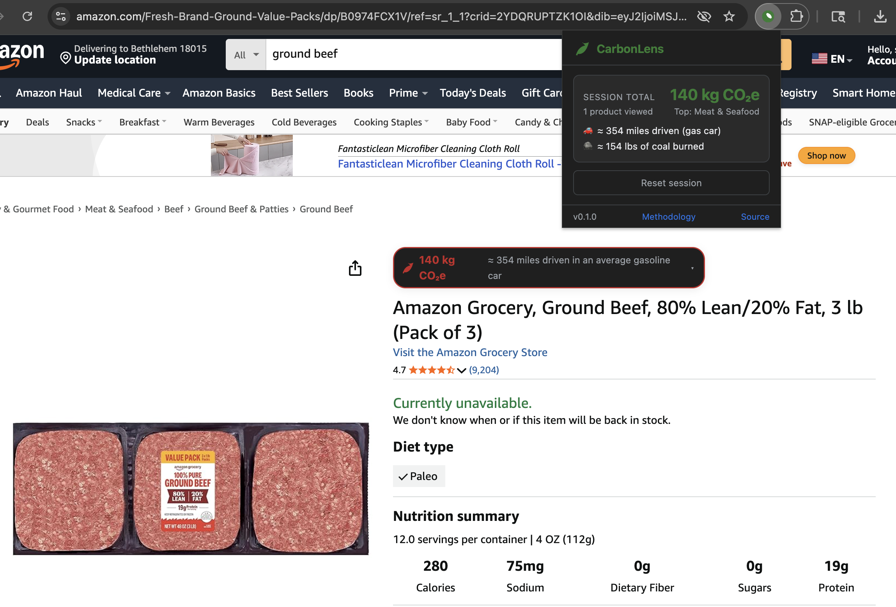

# CarbonLens

**See the hidden climate cost of anything you're about to buy.**

> A Chrome extension that shows estimated supply-chain CO₂ emissions on Amazon and Walmart product pages, using EPA-backed data.


---

## What It Does

CarbonLens injects a small badge near the product title on **Amazon** and **Walmart** product pages showing an estimate of the product's Scope 3 (supply-chain) greenhouse gas emissions in kg CO₂-equivalent. The badge is color-coded by emissions intensity (green/amber/red), shows a human-relatable comparison ("≈ 30 miles driven"), and expands to reveal the methodology, confidence level, and EPA data citation.

The extension also works on **Target, Best Buy, eBay, and Etsy** when those pages include structured product data (OpenGraph or JSON-LD).

A popup (extension icon) shows a running session total of emissions from all products viewed, along with equivalences and a reset button. All data is cleared when you close the browser — no tracking, no telemetry, no accounts.

**Why it exists:** Scope 3 Category 1 emissions (purchased goods and services) account for the majority of most institutions' and households' carbon footprints, yet shoppers never see this information at the point of purchase. CarbonLens surfaces it using the same spend-based methodology Amazon uses in its corporate carbon reporting — backed by EPA's Supply Chain Greenhouse Gas Emission Factors v1.3.0.

---

## Install (Local, Developer Mode)

1. `git clone <repo-url> && cd carbonlens`
2. Open `chrome://extensions` in Chrome or Edge.
3. Toggle **Developer mode** (top-right switch).
4. Click **Load unpacked** and select the repo folder.
5. Pin the CarbonLens icon from the Extensions menu (puzzle piece icon → pin CarbonLens).
6. Visit any Amazon or Walmart product page and look for the green/amber/red leaf badge near the price.

**Troubleshooting — badge doesn't appear?**
1. Open DevTools (F12) → Console tab.
2. Look for `[CarbonLens:Amazon]` or `[CarbonLens:Walmart]` log lines.
3. Most common cause: Amazon/Walmart updated their DOM selectors. Update the selector lists in `src/content/amazon.js` or `src/content/walmart.js`.
4. If the service worker shows an error on `chrome://extensions`, click "Reload" on the extension card.

---

## Screenshots

*Screenshots below were taken from the running extension on real product pages.*

**1. Collapsed badge (high-impact product — ground beef)**



**2. Expanded methodology card**



**3. Popup — session total**



---

## How the Number Is Calculated

CarbonLens uses the **spend-based method** from the GHG Protocol Scope 3 Technical Guidance (Chapter 7), backed by EPA's Supply Chain GHG Emission Factors v1.3.0 (derived from the USEEIO model):

```
kg CO₂e  =  (price_in_USD / CPI_deflator)  ×  factor_kg_co2e_per_2022_USD[category]
```

- **price_in_USD**: scraped from the product page
- **CPI_deflator**: 1.11 (cumulative US inflation 2022→2026)
- **factor**: from `data/emission_factors.json`, sourced from EPA USEEIO v1.3.0

Example: a $100 jacket → ($100 / 1.11) × 0.201 ≈ **18 kg CO₂e** ≈ 46 miles driven.

For food products, CarbonLens also queries the Open Food Facts API for product-specific LCA data (1.5s timeout; falls back to spend-based if unavailable).

See [docs/METHODOLOGY.md](docs/METHODOLOGY.md) for the complete treatment.

---

## Data Sources

| Source | Used For |
|---|---|
| **EPA Supply Chain GHG Emission Factors v1.3.0** (USEEIO-derived) | All 21 emission factors in `data/emission_factors.json`. [Full citation →](docs/DATA_SOURCES.md) |
| **EPA GHG Equivalencies Calculator** | Conversion factors in `data/equivalencies.json` (miles driven, coal burned, etc.) |
| **Open Food Facts** (optional) | Product-specific LCA for food items when available |

See [docs/DATA_SOURCES.md](docs/DATA_SOURCES.md) for full citations.

---

## Limitations

- **Order-of-magnitude uncertainty**: spend-based estimates can be off by 5× or more for specific products — two identical-price shirts from different brands may have very different real emissions.
- **2019 emissions data**: USEEIO factors reflect 2019 intensity; grid decarbonization and supply-chain shifts since then are not captured.
- **Heuristic classification**: a "smart coffee maker" might be misclassified; check the confidence level and category name in the expanded card.
- **US-focused model**: USEEIO includes import adjustments but imperfectly captures the diversity of global supply chains.
- **Discounted prices understate emissions**: a clearance-priced item still carries the environmental cost of producing it.
- **Educational only**: not a substitute for full LCA or supplier-disclosed Scope 3 data for institutional procurement decisions.

Full details: [docs/LIMITATIONS.md](docs/LIMITATIONS.md).

---

## Development

### Repo layout

```
src/           — Extension source code
  background/  — MV3 service worker (ES module)
  content/     — Per-site content scripts (IIFEs; self-contained)
    common/    — Source reference for shared logic (badge, parser utils)
  lib/         — Shared library (classifier, calculator, comparisons, session, food-lookup)
  popup/       — Extension popup (HTML/CSS/JS)
  styles/      — Badge CSS (source; inlined into content scripts)
data/          — Bundled JSON data files (emission factors, keywords, equivalencies)
assets/        — Icons and SVG
docs/          — Methodology, data sources, limitations, testing checklist
scripts/       — build_emission_factors.py (regenerate data from EPA CSV)
```

### Run unit tests

```bash
node --test src/lib/*.test.js
```

All tests should pass with zero failures. Covers classifier (18 cases) and calculator (27 cases).

### Rebuild emission factors from a newer EPA release

```bash
python3 scripts/build_emission_factors.py
```

Zero third-party dependencies (stdlib only). Run when EPA publishes v1.4 or later. Regenerate the PNG icons if needed:

```bash
python3 scripts/generate_icons.py
```

### Make a change → reload

1. Edit source files.
2. Go to `chrome://extensions`.
3. Click the circular reload icon on the CarbonLens card.
4. Refresh the product page you're testing.

---

## Roadmap

Future work (not implemented in MVP):

- Cart-level aggregation on Amazon's `/cart` page
- Firefox port (requires `browser_specific_settings` + API shims)
- User-submitted product-level LCA overrides
- Comparison mode ("show me a lower-emission alternative")
- Additional retailer-specific content scripts (Target, Best Buy native parsers)

---

## Credits & License

**Author:** Student, Environmental Science, Lehigh University, Spring 2026.

**Data:**
- EPA USEEIO Supply Chain GHG Emission Factors: U.S. Government Work (public domain). Credit: Wesley Ingwersen et al., U.S. EPA Office of Research and Development.
- Open Food Facts: Open Database License (ODbL). Credit: the Open Food Facts community and ADEME Agribalyse.
- EPA GHG Equivalencies Calculator: U.S. Government Work.

**Code:** MIT License — see [LICENSE](LICENSE).

---

## Contact

Questions or ideas? Open a GitHub issue.
